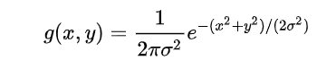

# Gaussian Filter Application

This project generates a matrix of pixel values, applies a Gaussian filter to smooth it, and normalizes the results. It's a basic implementation of Gaussian blurring, commonly used in image processing.

## Features

- Generate a matrix of random pixel values (0 to 255).
- Create a Gaussian kernel based on user-defined parameters.
- Normalize the kernel to ensure accurate filtering.
- Apply the Gaussian filter to the matrix using convolution.

## How It Works

1. The user specifies:
   - Matrix size (rows and columns).
   - Kernel size using `k` (filter size = `2k + 1`).
   - Standard deviation (`sigma`) for the Gaussian filter.

2. The application:
   - Generates a random pixel matrix.
   - Creates and normalizes the Gaussian kernel.
   - Applies the filter to the matrix, producing a smoothed output.

## Gaussian Filter Function
The Gaussian filter is generated using the following function:



## Convolution Product :

The image below illustrates the convolution process, where the kernel is slid over the matrix and a weighted sum of overlapping values is computed for each position:


## Usage

1. Compile the program using a C compiler (e.g., GCC):
   ```bash
   gcc -o convolution_app main.c -lm
   ```

2. Run the program:
   ```bash
   ./convolution_app
   ```

3. Follow the prompts to input matrix size, kernel size, and sigma.

## Example

Input:
- Matrix size: 5x5
- Kernel size: 3 (kernel = 3x3)
- Sigma: 1.0

Output:
- Original matrix
- Gaussian kernel (before and after normalization)
- Filtered matrix

## Requirements

- A C compiler (e.g., GCC).
- Standard math library (`-lm` flag).

## License

This project is free to use and modify.

